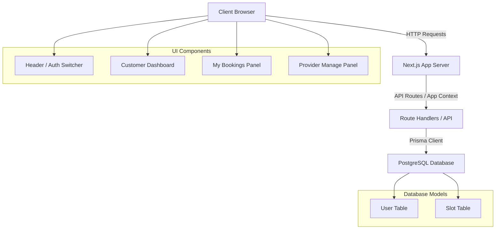
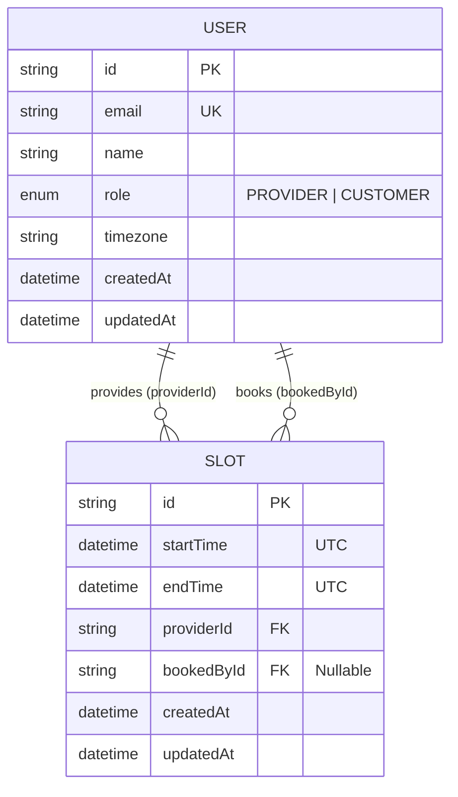
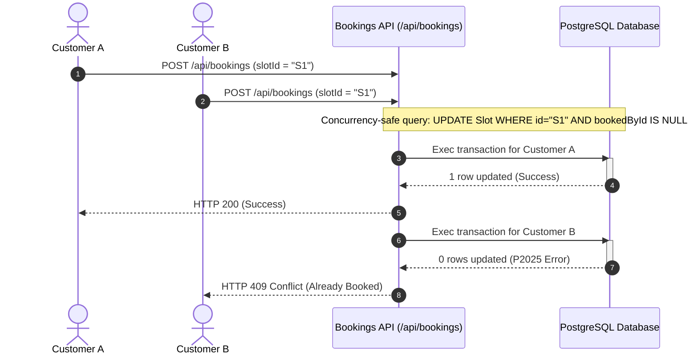
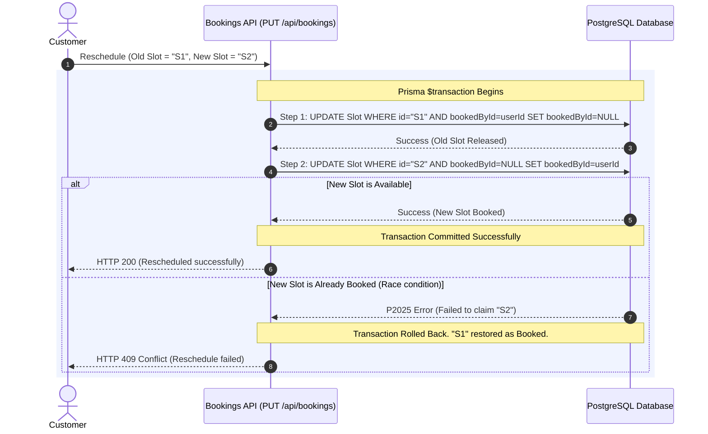

# System Design - Slot Booking Service

This document explains the system design, architecture, database design, and key execution flows of the Slot Booking Service.

---

## 1. System Architecture

The application is structured as a three-tier architecture utilizing Next.js (App Router), Prisma, and PostgreSQL.



---

## 2. Database Schema

The database design represents a one-to-many relationship from `User` to `Slot` twice:
1. `providerId`: Tracks the provider who created the slot (owner).
2. `bookedById` (nullable): Tracks the customer who booked the slot (booker).



### Constraints & Indexes
- **Indexes**:
  - `@@index([providerId])` - Speeds up fetching slots by a specific provider (very common for dashboard filtering).
  - `@@index([bookedById])` - Speeds up querying a customer's specific bookings.
  - `@@index([startTime])` - Optimizes date range filters when loading available slots.
- **On Delete Behaviors**:
  - If a provider is deleted (`onDelete: Cascade`), all their corresponding slots are deleted.
  - If a customer is deleted (`onDelete: SetNull`), the booking is released (`bookedById` becomes `null`), returning the slot to an available state.

---

## 3. Key Concurrency & Transaction Workflows

### Concurrency-Safe Booking Flow
To prevent race conditions where two customers attempt to book the same slot at the exact same millisecond, the database update checks that `bookedById` is still `null` at update time.



### Atomic Rescheduling Flow
Rescheduling involves releasing an existing booking and claiming a new available slot. This must happen atomically inside a transaction to prevent partial state updates (e.g., losing the original booking if the new slot booking fails).



---

## 4. Timezone Management Model

Timezone synchronization is resolved by decoupling **storage**, **creation**, and **display**:

```
+--------------------------------------------------------+
| 1. CREATION (Provider Alice, New York)                  |
|    - Alice inputs: 2026-07-17 at 9:00 AM (America/NY)   |
|    - System converts input local time to UTC:          |
|      "2026-07-17 09:00:00" @ New York -> 1:00 PM UTC   |
|    - Stored in PostgreSQL: "2026-07-17T13:00:00Z"      |
+--------------------------+-----------------------------+
                           |
                           v
+--------------------------------------------------------+
| 2. STORAGE (PostgreSQL Database)                       |
|    - Always stored in UTC format.                      |
+--------------------------+-----------------------------+
                           |
                           v
+--------------------------------------------------------+
| 3. DISPLAY (Customer Charlie, Tokyo)                   |
|    - Charlie views slots in Tokyo zone (Asia/Tokyo)    |
|    - App reads UTC value: "2026-07-17T13:00:00Z"       |
|    - Converts dynamically: 1:00 PM UTC -> 10:00 PM JST  |
|    - Charlie sees: Friday, July 17, 10:00 PM           |
+--------------------------------------------------------+
```

### Date Range Boundary Calculations
When filtering slots for a specific date (e.g. `2026-07-17`) in a timezone (e.g. `America/New_York`), we calculate the precise UTC boundaries:
- **Start**: `2026-07-17 00:00:00.000` New York time $\to$ `2026-07-17T04:00:00.000Z` UTC.
- **End**: `2026-07-17 23:59:59.999` New York time $\to$ `2026-07-18T03:59:59.999Z` UTC.
The Prisma query then checks `startTime >= start` and `startTime <= end`, ensuring that all slots falling into that New York day are returned, regardless of the customer's local viewing zone.
